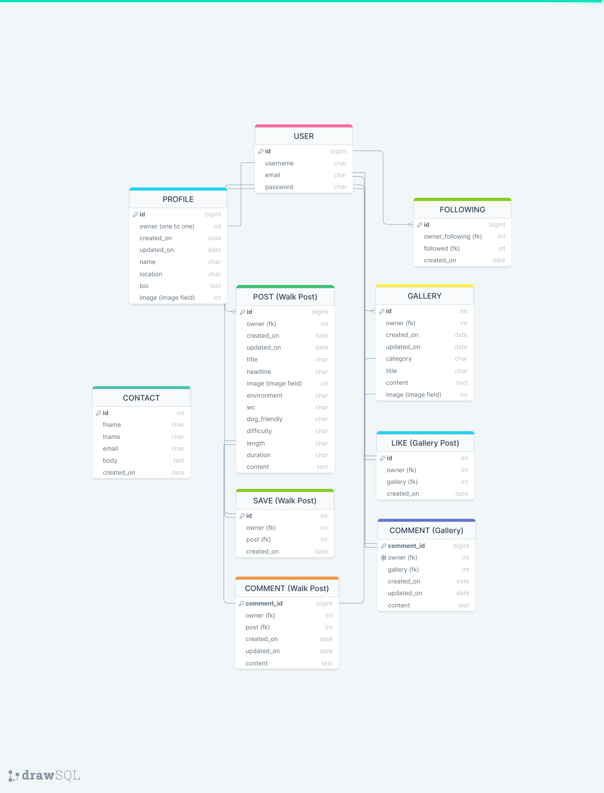
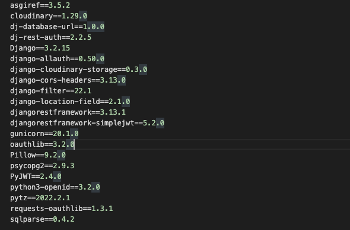

# Table of Contents

***

# Introduction

The Winding Path is a community site for lovers of walking and the great outdoors. Users can share information about their favourite walks, post photos or artwork that they have created and interact with other users via walk posts, gallery posts, comments and follows. 

This repository holds the Django Rest Framework (DRF) API database for the ReactJS frontend part of the project. 

[Deployed DRF API (via Heroku)](https://the-winding-path-drf-api.herokuapp.com/)

[Deployed Frontend](link here)

***

# Database Schema - Entity Relationship Diagram



***

# Testing
(link to separate tests.md file)
Implement manual testing and document the procedures and results. 

***

# Bugs

## Fixed

- When attempting to access the Profile edit page in the admin panel, I encountered the following error: "In order to use cloudinary storage, you need to provide CLOUDINARY_STORAGE dictionary with CLOUD_NAME, API_SECRET and API_KEY in the settings or set CLOUDINARY_URL variable (or CLOUDINARY_CLOUD_NAME, CLOUDINARY_API_KEY, CLOUDINARY_API_SECRET variables)".
This error was showing because the env.py file was not saved in the top directory of the project. Upon moving the file to the top directory, this error was rectified. 

- When attempting to render the Comment List views for Gallery and Walk posts I encountered the following error: " 'Meta.fields' must not contain non-model fieldnames". This error was showing as I had given the filterset_fields lists in each comment model the wrong value. I corrected the values to 'walk_post' and 'gallery_post', where they had previously been 'post' and 'gallery'. 

   


## Unfixed

***

# Technologies Used

## Modules



## Languages
- Python - The base language of the Django REST Framework

## Libraries
- Django Cloudinary Storage
- Pillow (image processing capabilities)
- Django Rest Auth
- PostgreSQL
- Cors Headers

## Frameworks
- Django REST Framework

## Platforms
- Cloudinary - Storage of image files
- Github - Repository with Git version control
- GitPod - IDE used for development
- Heroku - Platform for DRF

## Services 

- [DrawSQLapp](https://drawsql.app/) - Development of database schema

## Resources
- The Code Institute's DRF walkthrough was used as a guide on how to set up, build and deploy a DRF API. I customised existing models and created new ones as my confidence and knowledge grew. 
- The Code Institute DRF Cheat Sheet was used as a reference guide, particularly for specific terminal commands.
- Django Rest Framework documentation was relied on for additional functionality.
- W3C Schools and Stack Overflow were used for general enquiries relating to Django Rest Framework. 

***

# Project Setup

1. Create a new repository from the Code Institute template repository.
2. Run terminal command **pip3 install 'django<4'** to install Django.
3. Run terminal command **django-admin startproject pp5_drf_api .** (pp5-drf-ap is the name of my api - make to include the dot at the end to initialize project in it's current directory).
4. Run terminal command **pip install django-cloudinary-storage** to install Django Cloudinary Storage.
5. Run terminal command **pip install Pillow** to install Pillow image processing capabilities (note the uppercase 'P').
6. Add the newly installed apps 'cloudinary_storage' and 'cloudinary' to INSTALLED_APPS in settings.py as shown below:
```
INSTALLED_APPS = [
    'django.contrib.admin',
    'django.contrib.auth',
    'django.contrib.contenttypes',
    'django.contrib.sessions',
    'django.contrib.messages',
    'cloudinary_storage', 
    'django.contrib.staticfiles',
    'cloudinary',
]
```
7. Create env.py in the top directory, import os and add the CLOUDINARY_URL as shown below: 
```
import os
os.environ["CLOUDINARY_URL"] = "cloudinary://API KEY HERE"
```
8. Back in settings.py, load environment variable with Cloudinary credentials, set a CLOUDINARY_STORAGE variable, define the MEDIA_URL folder and set a DEFAULT_FILE_STORAGE variable as follows: 
```
import os

if os.path.exists('env.py'):
    import env

CLOUDINARY_STORAGE = {
    'CLOUDINARY_URL': os.environ.get('CLOUDINARY_URL')
}
MEDIA_URL = '/media/'
DEFAULT_FILE_STORAGE = 'cloudinary_storage.storage.MediaCloudinaryStorage'
```

***

# Deployment

## Set up JSON Web Tokens (steps 1-17)

1. Firstly, to install JSON Web Token authentication run terminal command **pip install dj-rest-auth**

2. Add 'rest_framework.authtoken' and 'dj_rest_auth' to the list of INSTALLED_APPS in settings.py as below:
```
INSTALLED_APPS = [
    'django.contrib.admin',
    'django.contrib.auth',
    'django.contrib.contenttypes',
    'django.contrib.sessions',
    'django.contrib.messages',
    'cloudinary_storage',
    'django.contrib.staticfiles',
    'cloudinary',
    'location_field.apps.DefaultConfig',
    'rest_framework',
    'django_filters',
    'rest_framework.authtoken',
    'dj_rest_auth',
```

3. Add the dj-rest-auth urls paths to the main urls.py file as below: 
```
urlpatterns = [
    path('', root_route),
    path('admin/', admin.site.urls),
    path('api-auth/', include('rest_framework.urls')),
    path('dj-rest-auth/', include('dj_rest_auth.urls')),
```

4. Migrate the database with terminal command **python manage.py migrate**

5. For users to be able to register, install Django AllAuth with terminal command **pip install 'dj-rest-auth[with_social]'**

6. Add the following INSTALLED_APPS to settings.py:
```
    'django.contrib.sites',
    'allauth',
    'allauth.account',
    'allauth.socialaccount',
    'dj_rest_auth.registration',
```
7. Set SITE_ID in settings.py to 1: 
```
SITE_ID = 1
```

8. Add the registration urls below to the main urls.py file: 
```
    path(
        'dj-rest-auth/registration/', include('dj_rest_auth.registration.urls')
    ),
```

9. To install the JSON tokens, run terminal command **pip install djangoframework-simplejwt**

10. Set [DEV] to 1 in the env.py file:
```
os.environ['DEV'] = '1'
```

11. This value can be used to check if project is in development or production. Add the following if/else statement to settings.py: 
```
REST_FRAMEWORK = {
    'DEFAULT_AUTHENTICATION_CLASSES': [(
        'rest_framework.authentication.SessionAuthentication'
        if 'DEV' in os.environ
        else 'dj_rest_auth.jwt_auth.JWTCookieAuthentication'
    )],
```

12. To enable token authentication, set REST_USE_JWT to True. To ensure tokens are sent over HTTPS only, set JWT_AUTH_SECURE to True. Cookie names must also be declared. To do all of this, add the following code below the if/else statement just added to settings.py: 
```
REST_USE_JWT = True
JWT_AUTH_SECURE = True
JWT_AUTH_COOKIE = 'my-app-auth'
JWT_AUTH_REFRESH_COOKIE = 'my-refresh-token'
```

13. Create serializers.py file in the drf_api directory, and copy UserDetailsSerializer code from Django documentation as follows:
```
from dj_rest_auth.serializers import UserDetailsSerializer
from rest_framework import serializers


class CurrentUserSerializer(UserDetailsSerializer):
    """Serializer for Current User"""
    profile_id = serializers.ReadOnlyField(source='profile.id')
    profile_image = serializers.ReadOnlyField(source='profile.image.url')

    class Meta(UserDetailsSerializer.Meta):
        """Meta class to to specify fields"""
        fields = UserDetailsSerializer.Meta.fields + (
            'profile_id', 'profile_image'
        )
``` 

14. Overwrite the default user detail serializer in settings.py with the following:
```
REST_AUTH_SERIALIZERS = {
    'USER_DETAILS_SERIALIZER': 'drf_api.serializers.CurrentUserSerializer'
}
```

15. Migrate the database again with terminal command **python manage.py migrate**

16. Update requirements.txt file with new dependencies by running terminal command **pip freeze > requirements.txt**

17. Add, commit and push changes. 

## Prepare API for deployment to Heroku (steps 18-24)

18. To add a custom message to the root_route, create a views.py file in the drf_api directory and add the following code:

```
from rest_framework.decorators import api_view
from rest_framework.response import Response

@api_view()
def root_route(request):
    return Response({
        "message": "Welcome to The Winding Path drf API!"
    })
```

19. Import to the main urls.py file, and add to the top of the urlpatterns list as follows: 

```
from .views import root_route

urlpatterns = [
    path('', root_route),

```

20. To set up page pagination, add the following to settings.py (inside REST_FRAMEWORK):
```
REST_FRAMEWORK = {
    'DEFAULT_AUTHENTICATION_CLASSES': [(
        'rest_framework.authentication.SessionAuthentication'
        if 'DEV' in os.environ
        else 'dj_rest_auth.jwt_auth.JWTCookieAuthentication'
    )],
    'DEFAULT_PAGINATION_CLASS':
    'rest_framework.pagination.PageNumberPagination',
    'PAGE_SIZE': 10,
}
```

21. Set the default renderer to JSON for the production environment in settings.py:
```
if 'DEV' not in os.environ:
    REST_FRAMEWORK['DEFAULT_RENDERER_CLASSES'] = [
        'rest_framework.renderers.JSONRenderer',
    ]
```

22. To set up DATETIME_FORMAT, add the following to settings.py (inside REST_FRAMEWORK, under DEFAULT_PAGINATION_CLASS):
```
'DATETIME_FORMAT': '%d %b %y',
```

23. For comments, set DATETIME format to show how long ago a comment was created and updated. To do this, add the following code to any serializers.py files within comment apps: 

```
from django.contrib.humanize.templatetags.humanize import naturaltime

created_on = serializers.SerializerMethodField()
updated_on = serializers.SerializerMethodField()

    def get_created_on(self, obj):
        """Method to display when comment was posted"""
        return naturaltime(obj.created_on)

    def get_updated_on(self, obj):
        """Method to display when comment was updated"""
        return naturaltime(obj.updated_on)

```

24. Add, commit and push changes 

## Deploy to Heroku (steps 25 - )

25. Log into Heroku and create a new app. 

26. Go to 'Resources' to search for Heroku Postgres in the Add-Ons section, and select the free plan.

27. Go to 'Settings' and click on 'Reveal Config Vars' to confirm DATABASE_URL is present. 

28. Go back to Git workspace and run terminal command **pip install dj_database_url psycopg2** to install the relevant libraries needed to use a Heroku postgres database. 

29. Import dj_database_url to settings.py:
```
import dj_database_url
```

30. Go to DATABASES in settings.py and separate development and production environments: 
```
DATABASES = {
    'default': ({
        'ENGINE': 'django.db.backends.sqlite3',
        'NAME': BASE_DIR / 'db.sqlite3',
    } if 'DEV' in os.environ else dj_database_url.parse(
        os.environ.get('DATABASE_URL')
    ))
}
```

31. Install Gunicorn library by running terminal command **pip install gunicorn**

32. Add a Procfile to the top level of the directory and add the following code to the file: 
```
release: python manage.py makemigrations && python manage.py migrate
web: gunicorn drf_api.wsgi
```

33. Set ALLOWED_HOSTS in settings.py: 
```
ALLOWED_HOSTS = [
    os.environ.get('ALLOWED_HOST'),
    'localhost',
]
```

 
***


# References

***

# Credits


