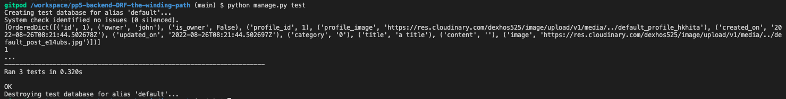
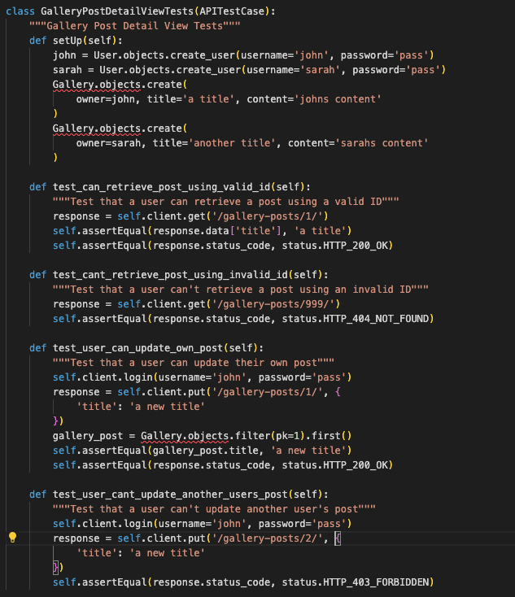
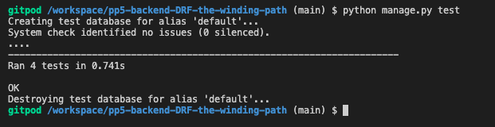
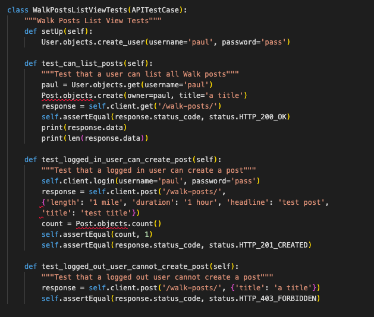
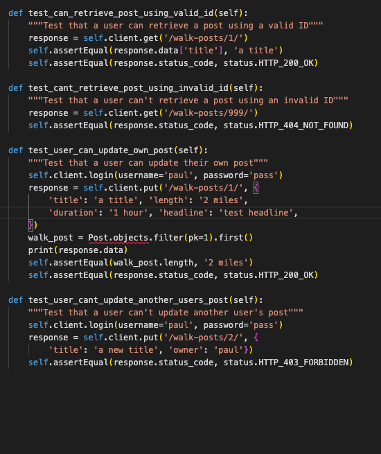
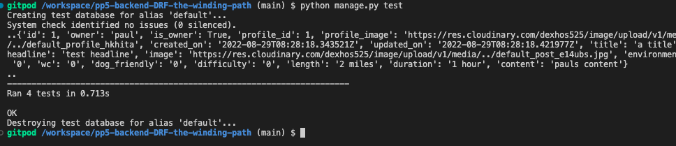

## Table of contents
1. [Unit Testing](#unit-testing)
    - [Views](#views) 
    - [Forms](#forms)
- [Validator Testing](#validator-testing)
    - [PEP8](#pep8)
- [Manual Testing](#responsive-testing)
***

# Unit Testing
I have performed the following unit tests using the Red Green Refactor principle:

## Gallery Post List View

Result:

## Gallery Post Detail View

Result:

## Walk Post List View

Result:

## Walk Post Detail View

Result:

***

# Validator Testing