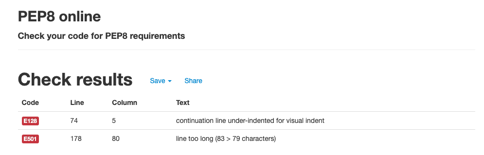
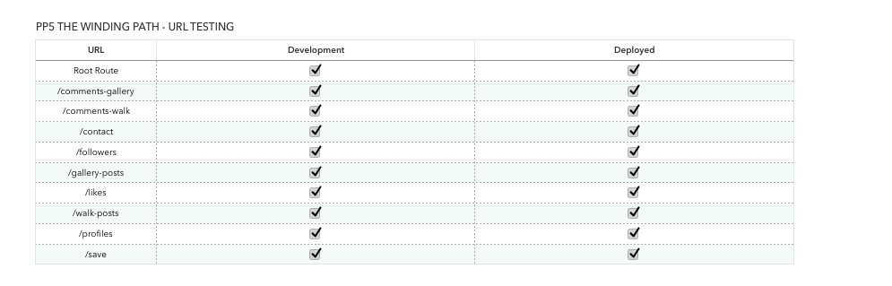
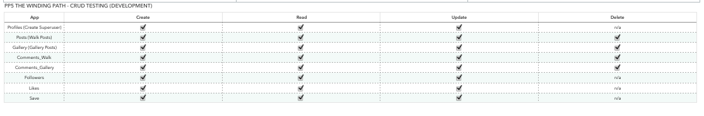
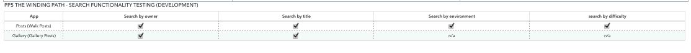

## Table of contents
1. [Unit Testing](#unit-testing)
    1. [Gallery Post List View](#gallery-post-list-view)
    2. [Gallery Post Detail View](#gallery-post-detail-view) 
    3. [Walk Post List View](#walk-post-list-view)
    4. [Walk Post Detail View](#walk-post-detail-view)
2. [Validator Testing](#validator-testing)
3. [Manual Testing](#manual-testing)
    1. [URL Testing](#url-testing)
    2. [CRUD Testing](#crud-testing)
    3. [Search Functionality Testing](#search-functionality-testing)

***

# Unit Testing
I have performed the following unit tests using the Red Green Refactor principle:

## Gallery Post List View

Result:

## Gallery Post Detail View

Result:

## Walk Post List View

Result:

## Walk Post Detail View

Result:

***

# Validator Testing

All python files passed through the PEP8 validator with no issues, apart from some long-line errors which were rectifed. One long-line error remains in settings.py (line 178): 

***

# Manual Testing

## URL testing 
All urls were tested (development and deployed) and all worked as expected. 

## CRUD testing
All apps were tested to ensure appropriate CRUD functionality was present in the development version of DRF.

## Search Functionality testing
Search functionality was tested on Walk Posts and Gallery Posts, to ensure correct results were returned when searching by the relevant search fields for each app. 

