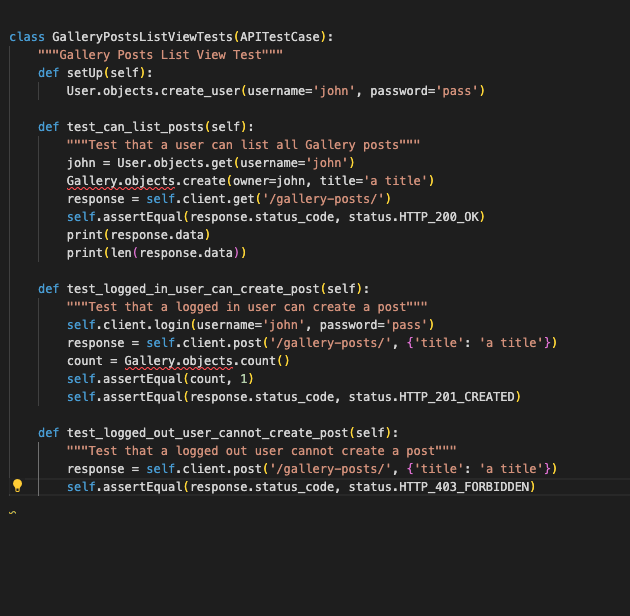

## Table of contents
1. [Unit Testing](#unit-testing)
    - [Views](#views) 
    - [Forms](#forms)
- [Validator Testing](#validator-testing)
    - [PEP8](#pep8)
- [Manual Testing](#responsive-testing)
***

# Unit Testing
I have performed the following unit tests using the Red Green Refactor principle:

## Gallery Post List View

Result:

## Gallery Post Detail View

Result:

## Walk Post List View

Result:

## Walk Post Detail View

Result:

***

# Validator Testing

All python files passed through the PEP8 validator with no issues, apart from some long-line errors which were rectifed. One long-line error remains in settings.py (line 178): 

***

# Manual Testing

## URL testing 
All urls were tested (development and deployed) and all worked as expected. 

## Crud testing
All apps were tested to ensure appropriate CRUD functionality was present in the development version of DRF.

## Search Functionality testing
Search functionality was tested on Walk Posts and Gallery Posts, to ensure correct results were returned when searching by the relevant search fields for each app. 

